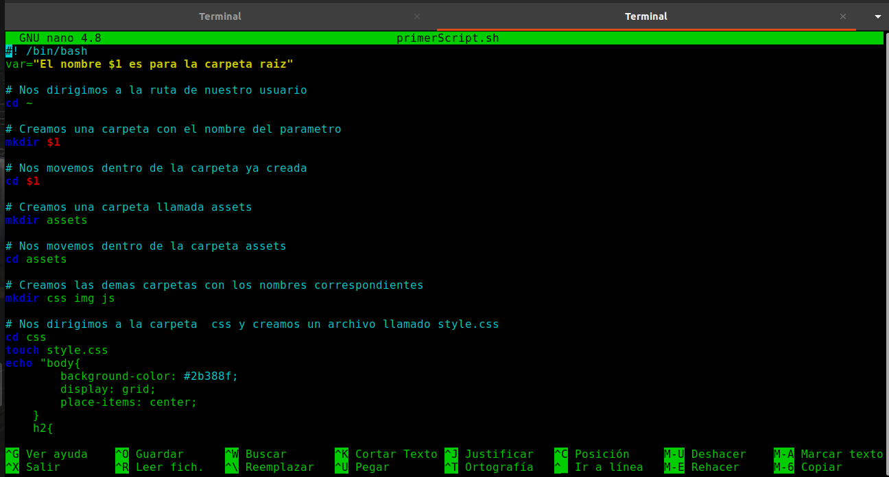
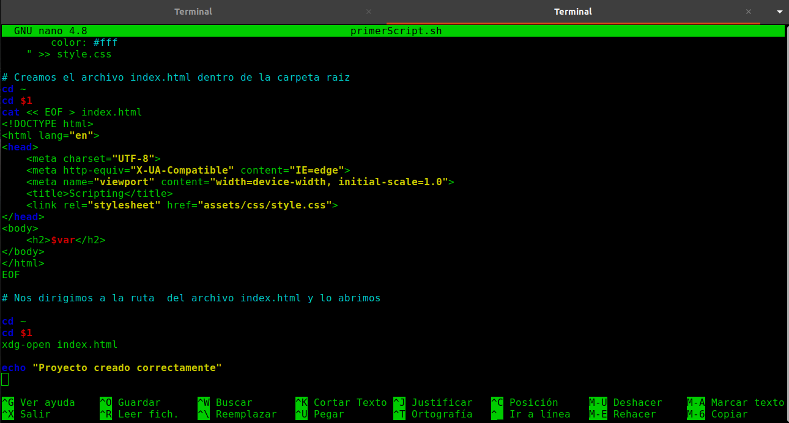
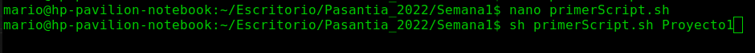
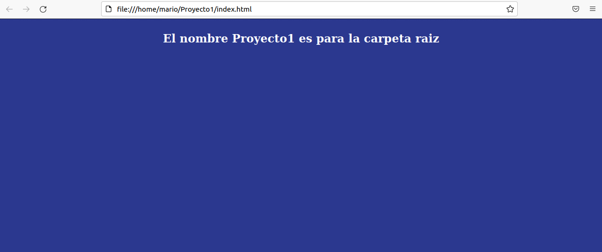

# **Creacion de un Script usando Bash en linux/Ubuntu**

La principal funcion de este script es basicamente crear un proyecto web basico utilizando archivos css y html almacenados en un arbol de directorios correspondientes, en donde al momento de ejecutar el archivo .sh le pasamos como parametro un nombre para la carpeta raiz del proyecto.

## Bash

Bash(Bourne Again Shell) es una herramienta popular de scripts disponible en Unix, en donde podemos reducir tareas repetitivas y cortas a una sola línea, a travéz de comandos en un solo código ejecutable.

## GNU nano

Es un editor de texto para terminal utilizado en sistemas Unix. basado en curses(biblioteca para el control de terminales sobre sistemas tipo Unix).

## Pasos para realizar de la actividad

- Abrimos nuestra terminal desde una carpeta y creamos el archivo con el siguiente comando.

    `touch primerScript.sh`

- Con el archivo ya creado en la carpeta procedemos a abrirlo con el editor de texto para terminal , en esete caso **nano**

    `nano primerScript.sh`

- Ya estando en el editor de texto el primer comando que debemos de tener escrito es el siguiente.

    `#! /bin/bash`

    esto es para indicarle al sistema que este archivo a interpretar es bash.

- Ahora con los siguientes comandos vamos a crear una variable para capturar el parametro, luego nos dirigirnos al directorio home, creamos una carpeta e ingresamos en ella. 

    `var="El nombre $1 es para la carpeta raiz"`

    `cd ~` 

    `mkdir $1`
    
    `cd $1`

- Con estos siguientes comandos creamos las carpetas restantes siguiendo la estructura del arbol de directorios mostrado.

    `mkdir assets` 

    `cd assets`
    
    `mkdir css img js`

- Luego nos dirigimos a la carpeta css, creamos el archivo style.css en la carpeta y escribimos el codigo correspondiente dentro de ese archivo .css

    
    `cd css` 

    `touch style.css`

    `echo`
    
    ~~~ 
    "body{
        background-color: #2b388f;
        display: grid;
        place-items: center;
    }
    h2{
        color: #fff
    " 
    ~~~
    `>> style.css `

- Para crear el archivo html dedemos de se seguir la misma logica que el paso anterior.

    `cd ~`

    `cd $1`

    `cat << EOF > index.html`
    ~~~
    <!DOCTYPE html>
    <html lang="en">
    <head>
        <meta charset="UTF-8">
        <meta http-equiv="X-UA-Compatible" content="IE=edge">
        <meta name="viewport" content="width=device-width, initial-scale=1.0">
        <title>Scripting</title>
        <link rel="stylesheet" href="assets/css/style.css">
    </head>
    <body>
        <h2>$var</h2>
    </body>
    </html>
    ~~~

    `EOF`
- Por ultimos abrimos el archivo index.html desde la carpeta donde se encuentra.

    `cd ~`
    
    `cd $1`
    
    `xdg-open index.html`

## Editor de texto nano con los comandos ya descritos

## Ejecucion del archivo .sh y su resultado

