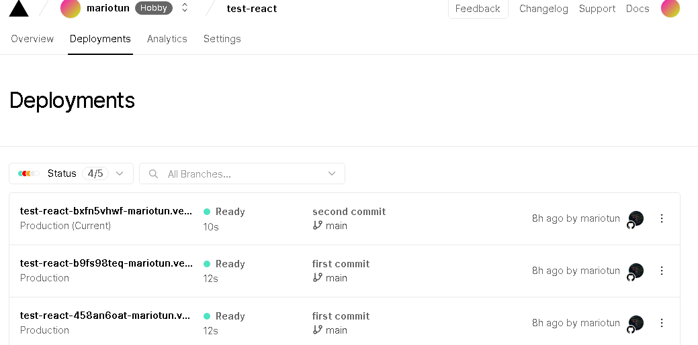

# **Creación de un proyecto básico con ReactJS utilizando herramientas para su construccion y despliegue**

## **Editores de texto**

* ### **¿Qué es un editor de texto?**
  #### Es un programa informático que permite crear y modificar archivos digitales compuestos únicamente por textos sin formato, conocidos comúnmente como archivos de texto o texto plano.

* ### **¿Cómo instalar VScode?**
  #### (1). Entrar en <https://code.visualstudio.com/download> y descargar el instalador de Visual Studio Code en el sistema operativo deseado. Podemos elegir entre Windows, Mac y Linux.
  #### (2). Abre el archivo de instalación .exe en tu carpeta de descargas para iniciar la instalación.
  #### (3). Lee y acepta el acuerdo de licencia. Haz clic en *Next* para continuar.
  #### (4). Puedes cambiar la ubicación de la carpeta de instalación o mantener la configuración predeterminada. Haz clic en Next para continuar.
  #### (5). Haz clic en *Install* para iniciar la instalación y cuando este ya instalado haz clic en *Finish* para finalizar la instalación y lanzar el programa.
  
---

## **NodeJS**

* ### **¿Qué es NodeJS?** 
  #### Es un entorno en tiempo de ejecución multiplataforma para la capa del servidor basado en JavaScript, controlado por eventos, diseñado para crear aplicaciones escalables permitiéndo establecer y gestionar múltiples conexiones al mismo tiempo.
* ### **¿Cómo se instala?**
  #### (1). Entrar en <https://nodejs.org/es/download/> y descargar el instalador de Node.js en el sistema operativo deseado. Podemos elegir entre Windows, Mac y Linux.
  #### (2). Ejecutar el instalador que acabamos de descargar. Simplemente debemos avanzar en el proceso de instalación.
  #### (3). Una vez finalizado el proceso de instalación, podemos comprobar fácilmente si se nos ha instalado correctamente , escribiendo el siguiente comando en nuestra terminal o cmd *`node -v`*
---

## **Vite**

* ### **¿Que es vite?**
  #### Se define como una herramienta de frontend que nos ayudará a crear proyectos de forma agnóstica *(sin atarte a ningún framework concreto)* y que su desarrollo y construcción final sea lo más sencilla y cómoda posible
* ### **¿Cómo crear y correr un proyecto con Vite?**
  #### Debemos de escribir los siguientes comandos en nuestra terminal o cmd.
  #### `npm create vite@latest primera-app-react --template react`
  #### Nos aparecera las siguientes opciones y en nuestro caso elegimos react.
  
  #### Luego nos menciona si queremos usar react con typescript o no, seleccionamos solo react.
  
  #### Por ultimo devemos de escribir los comandos de forma ordenada como se nos muestra para poder correr el proyecto.
  
  #### Despues de ejecutar el ultimo comado ya mostrado anteriormente nos dirigimos al link que nos presenta y este seria el resultado final.
  

---

## **GitHub**

* ### **¿Qué es GitHub?**
  #### Es una forja *(plataforma de desarrollo colaborativo)* para alojar proyectos utilizando el sistema de control de versiones Git, utilizado principalmente para la creación de código fuente de programas de ordenador.

* ### **¿Como creo un repositorio y subir mi proyecto?**
  #### (1). Nos dirigimos a nuestra cuenta y presionamos el sigmo "+" , luego le damos en nuevo repositorio.
  
  #### (2). Nos aparecera la siguiente ventana en donde debemos de escribir un nombre y establecer si nuestro repositorio sera publico o privado.
  
  #### (3). Escribimos los siguientes comandos desde la ruta de nuestro proyecto a travez de la terminal o cmd.
  

---

## **Vercel**

* ### **¿Que es vercel?**
  #### Es una plataforma en la nube que permite a los desarrolladores alojar sitios web y servicios web que se implementan instantáneamente, escalan automáticamente y no requieren supervisión.
* ### **¿Como se utiliza vercel?**
  #### (1). Nos dirigimos a <https://vercel.com/> y nos creamos una cuenta utilizando nuestra cuenta de GitHub.
  
  #### (2). Luego nos muestra todos nuestros repositorios y elegimos el que deseamos importar.
  
  #### (3). Nos mostrara un dashboard parecido al siguiente ejemplo con los detalles de nuestras implementaciones en produccion de manera general.
  
  #### (4). En esta parte nos muestra el listado de todas nuestras nuevas implementaciones que agregamos a nuestro proyecto. Cabe mencionar que si agregamos nuevos cambios a nuestro proyecto estos apareceran en el deployment correspondiente a esta lista de manera automatica.
  
  

