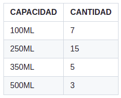
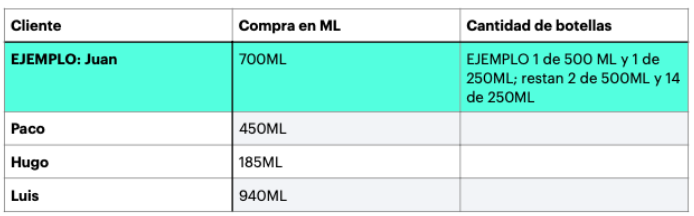
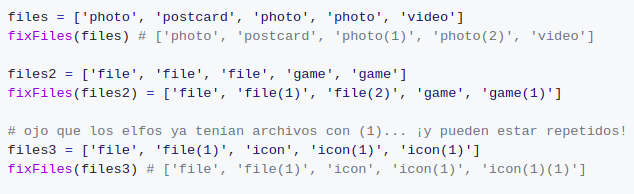

# **Ejercicio de logica General**

## Parte 1

1). ¿Qué haría usted para que cuando un cliente compre algún producto se utilicen la menor cantidad de botellas, y se desperdicie la menor cantidad de espacio en las mismas.?

- Preguntar a los clientes cual seria la cantidad en ml aproximado de producto utilizado en una semana, esto para poder escoger botellas de diferentes capacidades y poder satisfacer la cantidad de producto . Con los datos de ml aproximado en una semana podemos  evaluar si la próxima vez que venga , se tengan los recipientes suficientes de diferentes capacidades para la necesidad de producto deseado. 

2). Plasme la descripción de su algoritmo.

    Paso 1. Inicio
    Paso 2. Obtener la cantidad en ml de producto aproximado.
    Paso 3. Evaluar y encontrar el espacio que satisfaga la cantidad en ml aproximada del Paso 2.
    Paso 4. Colocar un indice a cada botella para ver cuantos nos quedan en inventario.
    Paso 5. Hacer un calculo de cuando puede volver el cliente para estar listos.
    Paso 6. Fin.

3). Ejemplifique cómo distribuiría el liquido en los contenedores de la tabla de arriba con las siguientes compras ficticias, siguiendo su propuesta.

|Cliente |Compra en ML |Cantidad de botellas
|--------|-------------|---------
|Paco |450ml |1 de 100ml y 1 de 350 ml; restan 6 de 100ml y 4 de 350ml.
|Hugo |185ml |1 de 250ml; restan 13 de 250ml
|Luis |940ml |1 de 100ml , 1 de 350ml y 1 de 500ml; restan 5 de 100ml, 3 de 350ml y 1 de 	500ml
| | |

## Parte 2
Tenemos que crear una función que al pasarnos un array de nombres de archivo devolvamos un array con el mismo número de elementos pero donde los nombres que se repetían se anexe al final (k) donde k sería el número de veces que se encontró repetido. Ejemplo:

Plasme la descripción de su algoritmo.

    Paso 1. Inicio
    Paso 2. Recibir un array1 con nombres de archivos.
    Paso 3. Crear un nuevo array2 vació.
    Paso 4. Iteramos el array1 recibido.
    Paso 5. Verificamos que en el array2 no tenga un dato igual al item correspondiente del array1.
    Paso 6. Si lo tiene igual, ir a Paso 7, sino Paso 8
    Paso 7: Le posponemos (numero) al nombre ,ir a Paso 8. 
    Paso 8. Ingresamos el valor al nuevo array2.
    Paso 9. Si Llegamos al final de array1 ir a Paso 10, sino Paso 4.
    Paso 10. Fin