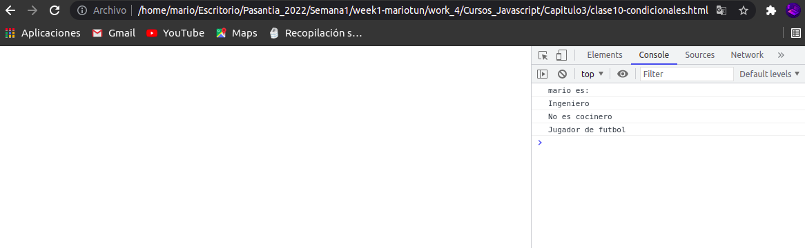

# Ejemplos del Curso de JavaScript

**Para poder ejecutar los archivos simplemente obtenemos la ruta del archivo .html , lo pegamos en el navegador y recargamos la pagina.**

 **NOTA: En algunos archivos .html debemos de llamar a las funciones en la consola del navegador para poder ver los resultados.**