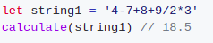
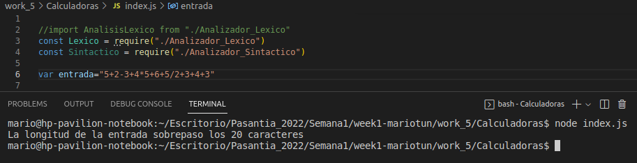
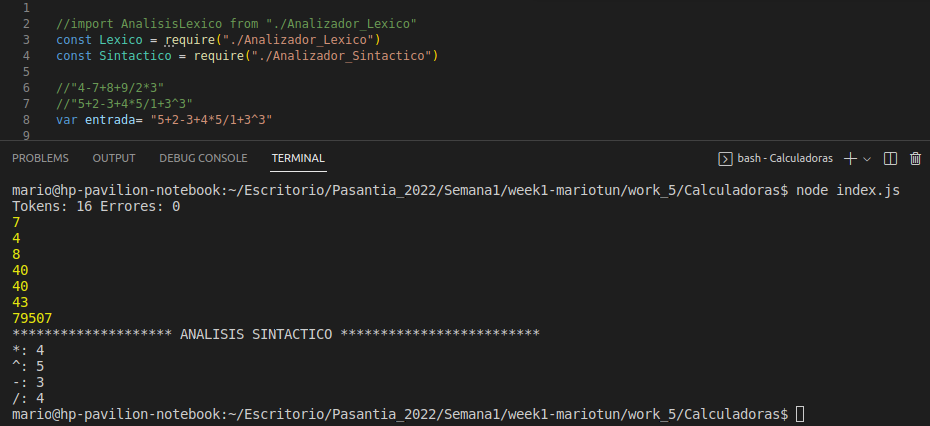
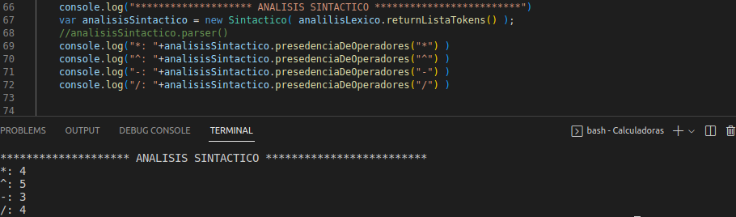

# **Reto de la semana**

En JavaScript Vanilla realice una calculadora de operaciones básicas que resuelva las operaciones dada una cadena.

## Restricciones:
- Deberá realizar las 4 operaciones básicas en la misma cadena suma +, resta -, Multiplicación *, División /
- La longitud maxima a ingresar de la cadena serán 20 caracteres.
- Se deberán respetar la prioridad de los operadores.
    - Punto extra si se utilizan paréntesis para agrupamiento y multiplicación
    - Punto Extra si se realiza potencia o raíz cuadrada
- Queda prohibido utilizar la función EVAL o equivalentes, o en su defecto incluir alguna librería que realice todo el proceso. (Recuerde que la finalidad de esto es evaluar la lógica de programación).

## Algoritmo

    paso 1: Obtener la cadadena de entrada.
    paso 2: Recorrer la cadena de entrada para saber su longitud.
    paso 3: Si longitud en mayor a 20 , ir a paso 4, sino paso 5.
    paso 4:Mostramos un mensaje de error y paramos la aplicacion.
    paso 5: Analizamos lexicamente que los caracteres sean validos para una operacion.
    paso 6: Si son validos empezamos a ver cuales operaciones tienen mayor precedencia e ir a paso 8, sino paso 7.
    paso 7: Mostramos un error de caracteres invalidos y paramos la ejecucion del analizador.
    paso 8: Operamos los digitos e introducimos el resultado en la posicion del segundo digido operado ,dentro del arreglo de caracteres.
    paso 9: Si es el ultimo caracter ir a paso 10, sino ir a paso 8.
    paso 10: fin.

**Comprobando que la cadena de entrada no tenga mas de 20 caracteres**

**Ejecucion de la operacion**

**El de numero mayor es el operador que tiene mayor precedencia y asi se debe manejar en este ejercicio**

